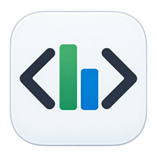
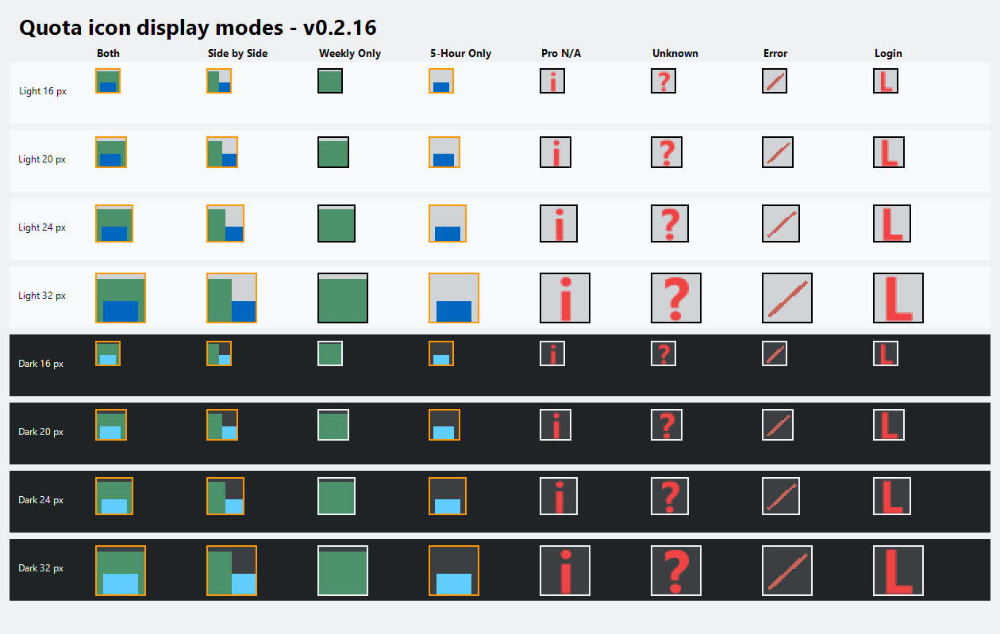
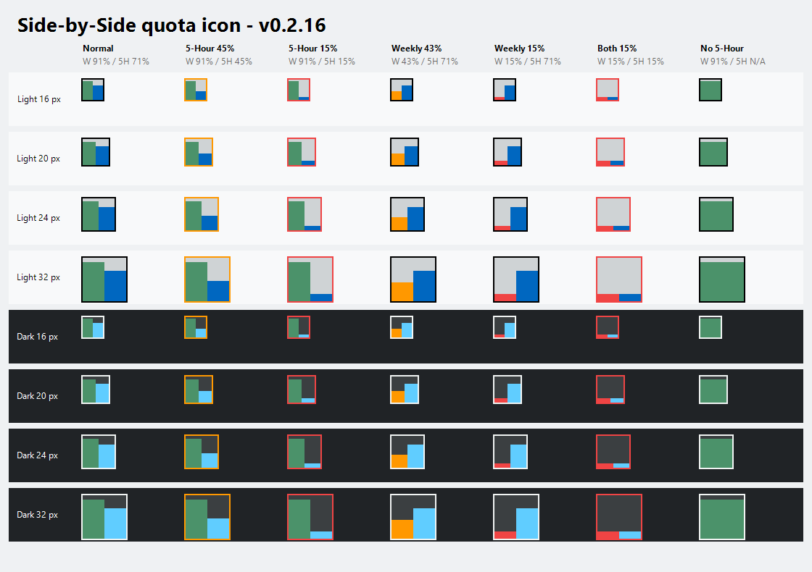
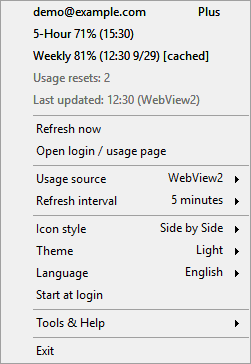
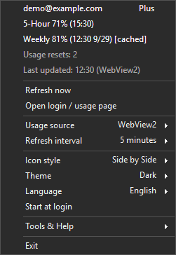
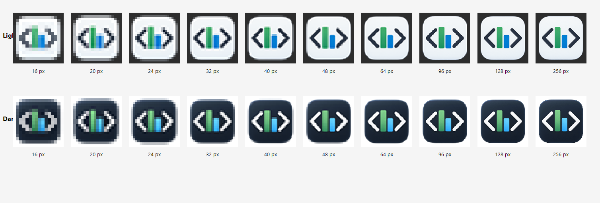

<div align="center">
  <picture>
    <source media="(prefers-color-scheme: dark)" srcset="docs/images/logo-dark.png">
    <source media="(prefers-color-scheme: light)" srcset="docs/images/logo-light.png">
    
  </picture>
  <h1>Codex Usage Tray Lite</h1>
  <p>A lightweight Windows tray companion for your remaining Codex usage.</p>
  <p>
    <a href="https://github.com/zjwww/Codex-Usage-Tray-Lite/releases/latest"></a>
    
    
    <a href="LICENSE"></a>
  </p>
  <p><a href="README.md">English</a> | <a href="README.zh-CN.md">简体中文</a> | <a href="https://github.com/zjwww/Codex-Usage-Tray-Lite/releases/latest">Download latest</a> | <a href="https://github.com/zjwww/Codex-Usage-Tray-Lite/issues">Report an issue</a></p>
</div>

## Overview

Codex Usage Tray Lite is an unofficial portable Windows notification-area utility. It displays remaining Weekly usage and, when applicable, 5-Hour usage through a dynamic tray icon, a compact tooltip, and a context menu.

It is not developed, endorsed, or supported by OpenAI. OpenAI, ChatGPT, and Codex belong to their respective trademark owners.

## Main features

- **Two usage sources:** sign in through an app-specific WebView2 browser, or use an installed Codex CLI already signed in with ChatGPT.
- **Four tray styles:** 5-Hour Only, Weekly Only, Stacked (Default), and Side by Side. Weekly fills the complete frame when the account authoritatively has no 5-Hour quota in Stacked or Side by Side.
- **Clear states:** distinguish remaining quota, unknown data, login required, fetch errors, and an inapplicable 5-Hour window. Missing values are never invented as zero.
- **Account details:** email, supported account level, quotas, available usage resets, and last update. The app only reads reset availability; it never consumes a reset.
- **Refresh controls:** manual refresh and intervals of 1, 2, 5, 10, 15, 30, or 60 minutes; the default is 15 minutes.
- **Appearance:** follow Windows, Light, or Dark; English, Simplified Chinese, Traditional Chinese, Japanese, and Korean UI. Compact tooltips remain in English.
- **Local preferences:** start at login, open logs/config folder, and WebView2 system/direct/HTTP/SOCKS5 proxy settings. Proxy authentication is not supported.
- **Short-lived collection:** WebView2 controllers and CLI processes are disposed after collection. No desktop widget, telemetry, developer-operated backend, installer, or automatic updater.

## Preview

These images are renderings using sample values, not screenshots of a live account. Tray previews use the application renderer at 16/20/24/32 px, enlarged for inspection.

### All tray styles and states



Weekly uses green above 50%, orange at 21–50%, and red at 0–20%. In dual-quota modes, the 5-Hour value independently controls its warning frame. `i` means the selected 5-Hour quota is not applicable, `?` means unknown, `/` means fetch error, and `L` means login required.

### Side by Side and Weekly-only accounts



### English menu

 

The menu rendering uses real English resource labels and the application menu renderer with sample data. In CLI mode, the login action becomes **Codex CLI login help**, and WebView2 proxy/session actions are hidden.

### Existing application icon



The static application icon is used by the executable and dialogs; the tray uses the dynamic quota styles above.

## Requirements

| Component | Requirement |
| --- | --- |
| Operating system | Windows 11 x64 (target environment) |
| Application runtime | .NET Framework 4.8 or later; not bundled |
| WebView2 source | Microsoft Edge WebView2 Evergreen Runtime and a ChatGPT login; runtime not bundled |
| Codex CLI source | Codex CLI on `PATH`, already signed in with ChatGPT; CLI and its runtime are not bundled |
| Connectivity | Access to the services required by the selected source |

Windows 10 and Windows on ARM are not validated targets. Python, Playwright, and a bundled Chromium browser are not required by this application.

## Install and start

1. Download the Windows x64 ZIP and matching `.zip.sha256` from the [latest Release](https://github.com/zjwww/Codex-Usage-Tray-Lite/releases/latest).
2. Compare the SHA-256 hash before extracting:

   ```powershell
   Get-FileHash .\CodexUsageTrayLite-v0.2.18-win-x64.zip -Algorithm SHA256
   Get-Content .\CodexUsageTrayLite-v0.2.18-win-x64.zip.sha256
   ```

3. Extract the **entire ZIP** into a permanent folder. Keep the DLLs and language folders beside the executable. Do not run from inside the ZIP.
4. Run `CodexUsageTrayLite.exe` and find its icon in the Windows notification area, including the overflow area.
5. For WebView2, choose **Open login / usage page**, sign in directly to ChatGPT, then close that window. For CLI, select **Usage source → Codex CLI** after signing in through the CLI.

A fresh installation waits for source setup instead of fetching automatically. Selecting a source validates it immediately; periodic refresh begins after a successful read. **Refresh now** retries the configured source. **Start at login** is optional.

The executable is not code-signed. Verify the download and its source before running it.

## Upgrade and removal

To upgrade, choose **Exit**, extract the new complete package, and replace the application files while it is stopped. Keep the same installation path if start at login is enabled, or disable/re-enable that option after moving the app. Settings and the WebView2 profile live outside the application folder and are retained.

To remove, disable **Start at login**, choose **Exit**, and delete the application folder. To also remove settings, logs, and saved WebView2 sessions, delete `%LOCALAPPDATA%\CodexUsageTrayLite` after exit.

## Privacy and troubleshooting

- Local data is stored under `%LOCALAPPDATA%\CodexUsageTrayLite`. Never publish its `webview2-profile` directory: it can contain an authenticated session.
- Account email is kept in memory and shown in the menu. Logs use a masked email. The app does not read Codex CLI credential files or another browser's profile.
- WebView2 owns its saved cookies/session; CLI owns its own authentication. No developer-operated server receives your data.
- Use **Open logs** for diagnostics. Review logs before attaching them to an issue. Daily log archives are not automatically removed.
- If WebView2 login expires, reopen the login page. A missing runtime must be installed separately. CLI mode needs a working, signed-in CLI on `PATH`.
- WebView2 collection depends on the website layout; CLI collection depends on the installed app-server protocol. Upstream changes can break either source.

## Build and validation

Build on Windows with a .NET SDK capable of building the .NET Framework 4.8 project. NuGet restores the framework reference assemblies and WebView2 SDK.

```powershell
dotnet restore .\CodexUsageTrayLite.sln --configfile .\NuGet.Config
dotnet build .\CodexUsageTrayLite.sln -c Release -p:Platform=x64 --no-restore
& .\tests\CodexUsageTrayLite.Tests\bin\x64\Release\net48\CodexUsageTrayLite.Tests.exe
```

The v0.2.18 build passed **89 automated tests**. This covers parsers, settings, localization, renderer pixels, process cleanup, and simulated resource lifecycles; it is not proof of every authenticated browser flow, proxy setup, hardware DPI, or an 8–12 hour soak. See [validation details](TESTING.md).

## License and acknowledgments

Licensed under **GPL-3.0-only**. When distributing a modified version, provide its corresponding source under the GPL. Private modifications do not require publication. See [LICENSE](LICENSE) and [third-party notices](THIRD_PARTY_NOTICES.md); upstream MIT notices are retained.

- [saveway/codex-usage-monitor](https://github.com/saveway/codex-usage-monitor) — the MIT-licensed native WebView2 preview was the original baseline (`v2.0.0-preview.7`, commit `36e9679164dcd7e5ef23d1f35822664785fad01f`).
- [ognjeeen/codex-usage-widget](https://github.com/ognjeeen/codex-usage-widget) — an MIT-licensed reference project.
